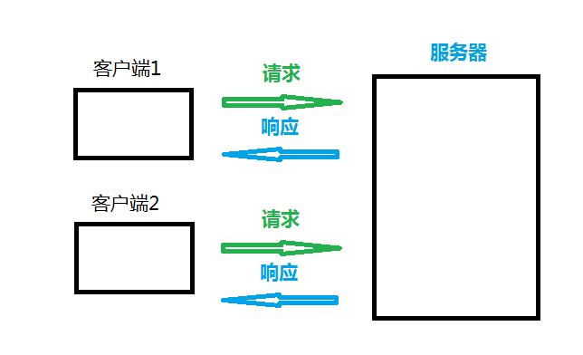

#  《Django Web框架笔记》
### 目录
[TOC]

- 课程特点：学习阶段注重框架使用，工作阶段注重实现业务逻辑
## Django框架的介绍
- 2005年发布,采用Python语言编写的开源web框架
- 早期的时候Django主做新闻和内容管理的
- 一个重量级的 Python Web框架，Django 配备了常用的大部分组件
    1. 基本配置
    1. 路由系统
    1. 原生HTML模板系统
    1. 视图 view
    1. Model模型,数据库连接和ORM数据库管理
    1. 中间件
    1. Cookie & Seesion
    1. 分页
    1. 数据库后台管理系统admin

- Django的用途
    - 网站后端开发
    - 微信公众号、微信小程序等后台开发
    - 基于HTTP/HTTPS协议的后台服务器开发
        - 在线语音/图像识别服务器
        - 在线第三方身份验证服务器等
- Django的版本
    - 最新版本:2.2.x
    - 使用版本:1.11.8  == A.B.C

- Django的官网
    - 官方网址: <http://www.djangoproject.com>
    - 1.11文档：docs.djangoproject.com/en/1.11/
    - 中文文档(第三方):
        - <https://yiyibooks.cn/>
        - <http://djangobook.py3k.cn/>
    - Django的离线文档
        1. 解压缩数据包 `django-docs-1.11-en.zip`
        2. 用浏览器打开 `django-docs-1.11-en/index.html`


### Django的安装
- 查看已安装的版本
    ```python
    >>> import django
    >>> print(django.VERSION)
    (1, 11, 8, 'final', 0)
    ```
    
- 安装
    1. 在线安装
        - `$ sudo pip3 install django`  安装django的最新版本
        - 或
        - `$ sudo pip3 install django[==版本]` 安装django的指定版本
        - 如:
            - `$ sudo pip3 install django==1.11.8`
    2. 离线安装
        - 下载安装包:
        - 安装离线包
            - `$ tar -xvf Django-1.11.8.tar.gz`
            - `$ cd Django-1.11.8`
            - `$ sudo python3 setup.py install`
    3. 用wheel离线安装
        - 下载安装包:
            - `pip3 download -d /home/tarena/django_packs django==1.11.8`
        - 安装离线包
          - $ pip3 install Django-1.11.8.whl
    
- Django的卸载
  
  ```
  $ pip3 uninstall djan
  ```
  
  go
  
- Django 的开发环境
    - Django 1.11.x 支持 Python 2.7, 3.4, 3.5 和 3.6（长期支持版本 LTS)
    - 注: Django 1.11.x 不支持 Python 3.7


## Django框架开发
### 创建运行项目的指令
  - $ django-admin startproject 项目名称

  - 如:
    
    - $ django-admin startproject mysite1
    
  - 运行
    
    ```shell
    $ cd mysite1
    $ python3 manage.py runserver
    # 或                         
    $ python3 manage.py runserver 5000  # 指定只能本机使用127.0.0.1的5000端口访问本机
    ```
### 启动django报错解决方案

```
若启动django时，【python3 manage.py runserver】报如下错误：
Error:That port is already in use
	解决方案：
		分析：当前有其他进程占用8000端口
		方案1：ps aux|grep 'manage' -> kill -9 进程id
		方案2：更换端口启动  python3 manage.py runserver 8080
```

```
地址已存在解决方案
tarena @ tedu：〜$ netstat -apn | grep 5000
tcp 0 0 127.0.0.1:5000 0.0.0.0:* LISTEN 10764 / python3.6     
tarena @ tedu：〜$ kill -9 10764-（LISTEN 10764 / python3.6）
```
### Django项目的目录结构
- 示例:
    ```shell
    $ django-admin startproject mysite1
    $ tree mysite1/
    mysite1/
    ├── manage.py
    └── mysite1
        ├── __init__.py
        ├── settings.py
        ├── urls.py
        └── wsgi.py

    1 directory, 5 files
    ```
    
- 项目目录结构解析:
    - manage.py
        - 此文件是项目管理的主程序,在开发阶段用于管理整个项目的开发运行的调式
        - `manage.py` 包含项目管理的子命令, 如:
            - `python3 manage.py runserver` 启动服务
            - `python3 manage.py startapp` 创建应用
            - `python3 manage.py migrate` 数据库迁移
            - `...`
    - mysite1 项目包文件夹
        - 项目包的主文件夹(默认与项目名称一致)
        1. `__init__.py`
            - 包初始化文件,当此项目包被导入(import)时此文件会自动运行
        2. `wsgi.py`
            - WSGI 即 Web Server Gateway Interface
            - WEB服务网关接口的配置文件，仅部署项目时使用
        3. `urls.py`
            - 项目的基础路由配置文件，所有的动态路径必须先走该文件进行匹配
        4. `settings.py`
            - Django项目的配置文件, 此配置文件中的一些全局变量将为Django框架的运行传递一些参数
            - setting.py 配置文件,启动服务时自动调用，
            - 此配置文件中也可以定义一些自定义的变量用于作用全局作用域的数据传递

- `settings.py` 文件介绍
  
    https://docs.djangoproject.com/en/1.11/ref/settings/
    
    ```
    settings.py
    --->第4行显示版本：
    Generated by 'django-admin startproject' using Django 1.11.8.
    ---># 第16行显示当前项目的绝对路径
    BASE_DIR = os.path.dirname(os.path.dirname(os.path.abspath(__file__)))
    --->第26行DEBUG = True表示开发环境中使用 `调试模式`(用于开发中)
    DEBUG = True
    ```
    
    1. `BASE_DIR`
       
        - 用于绑定当前项目的绝对路径(动态计算出来的), 所有文件都可以依赖此路径
        
    2. `DEBUG`
       
        - 用于配置Django项目的启用模式, 取值:
            1. True 表示开发环境中使用 `调试模式`(用于开发中)
            2. False 表示当前项目运行在`生产环境中`(不启用调试)
        
    3. `ALLOWED_HOSTS`
       
        - 设置允许访问到本项目的网络地址列表,取值:
            1. [] 空列表,表示只有`127.0.0.1`, `localhost`能访问本项目
            2. ['*']，表示任何网络地址都能访问到当前项目
            3. ['192.168.1.3', '192.168.3.3'] 表示只有当前两个主机能访问当前项目
            - 注意:
                - 如果要在局域网其它主机也能访问此主机,启动方式应使用如下模式:
        - `python3 manage.py runserver 0.0.0.0:5000` # 指定网络设备所有主机都可以通过5000端口访问(需加`ALLOWED_HOSTS = ['*']`) 
        
    4. `INSTALLED_APPS`
       
        - 指定当前项目中安装的应用列表
        
    5. `MIDDLEWARE`
       
        - 用于注册中间件
        
    6. `TEMPLATES`    ----html配置
       
        - 用于指定模板的配置信息
        
    7. `DATABASES` ----76行
       
        - 用于指定数据库的配置信息
        
    8. `LANGUAGE_CODE = 'zh-Hans'`  -----106行语言修改
       
        - 用于指定语言配置
        - 取值:
            - 英文 : `"en-us"`
            - 中文 : `"zh-Hans"`
        
    9. `TIME_ZONE = 'Asia/Shanghai' ---108行 时区`
       
        - 用于指定当前服务器端时区
        - 取值:
            - 世界标准时间: `"UTC"`
            - 中国时区 : `"Asia/Shanghai"`
        
    10. `ROOT_URLCONF= 'mysite1.urls'----52行`
        
        ###### # 请求的分发入口urlpatterns = [    url(r'^admin/', admin.site.urls),]
        
        - 用于配置根级 url 配置 'mysite1.urls'
        - 如:
            - `ROOT_URLCONF = 'mysite1.urls'`
    > 注: 此模块可以通过 `from django.conf import settings` 导入和使用


### URL 介绍
- url 即统一资源定位符 Uniform Resource Locator
- 作用:
  
    - 用来表示互联网上某个资源的地址。
- 说明:
  
    - 互联网上的每个文件都有一个唯一的URL，它包含的信息指出文件的位置以及浏览器应该怎么处理它。
- URL的一般语法格式为：
    ```
    protocol :// hostname[:port] / path [?query][#fragment]
    ```
- 如:
    ```
    http://tts.tmooc.cn/video/showVideo?menuId=657421&version=AID201908#subject
    ```

- 说明:
    - protocol（协议）
        - http 通过 HTTP 访问该资源。 格式 `HTTP://`
        - https 通过安全的 HTTPS 访问该资源。 格式 `HTTPS://`
        - file 资源是本地计算机上的文件。格式: `file:///`
        - ...

    - hostname（主机名）
        - 是指存放资源的服务器的域名系统(DNS) 主机名、域名 或 IP 地址。
        
    - port（端口号）
        - 整数，可选，省略时使用方案的默认端口；
        - 各种传输协议都有默认的端口号，如http的默认端口为80。https默认端口为443.
    - path（路由地址）
        - 由零或多个“/”符号隔开的字符串，一般用来表示主机上的一个目录或文件地址。路由地址决定了服务器端如何处理这个请求

    - query(查询)
        - 可选，用于给动态网页传递参数，可有多个参数，用“&”符号隔开，每个参数的名和值用“=”符号隔开。
    - fragment（信息片断）
        - 字符串，用于指定网络资源中的片断。例如一个网页中有多个名词解释，可使用fragment直接定位到某一名词解释。
    - 注: [] 代表其中的内容可省略


### 视图函数(view)
- 视图函数是用于接收一个浏览器请求并通过HttpResponse对象返回数据的函数。此函数可以接收浏览器请求并根据业务逻辑返回相应的内容给浏览器
- 视图处理的函数的语法格式:
    ```python
    def xxx_view(request[, 其它参数...]):
        return HttpResponse对象
    ```
- 参数:
  
    - request用于绑定HttpRequest对象，通过此对象可以获取浏览器的参数和数据
- 示例:
    - 视图处理函数 `views.py` 
        ```python
        # file : <项目名>/views.py
        from django.http import HttpResponse
        def page1_view(request):
            html = "<h1>这是第1个页面</h1>"
            return HttpResponse(html)
        ```

### Django 中的路由配置
- settings.py 中的`ROOT_URLCONF` 指定了主路由配置列表urlpatterns的文件位置
- urls.py 主路由配置文件
    ```python
    # file : <项目名>/urls.py
    urlpatterns = [
        url(r'^admin/', admin.site.urls),
        ...  # 此处配置主路由
    ]
    ```
    > urlpatterns 是一个路由-视图函数映射关的列表,此列表的映射关系由url函数来确定

3. url() 函数
    - 用于描述路由与视图函数的对应关系
    - 模块
        - `from django.conf.urls import url`
    - 语法:
        - url(regex, views, name=None)
        - 参数：
            1. regex: 字符串类型，匹配的请求路径，允许是正则表达式
            2. views: 指定路径所对应的视图处理函数的名称
            3. name: 为地址起别名，在模板中地址反向解析时使用
    
    > 每个正则表达式前面的r表示`'\'`不转义的原始字符串


- 练习
    - 建立一个小网站:
        - 输入网址: http://127.0.0.1:8000, 在网页中输出 : 这是我的首页
        - 输入网址: http://127.0.0.1:8000/page1, 在网页中输出 : 这是编号为1的网页
        - 输入网址: http://127.0.0.1:8000/page2, 在网页中输出 : 这是编号为2的网页
        > 提示: 主页路由的正则是  `r'^$'`
        - 思考
            
            - ```
              def  pagen_view(request,n):
                  html='<h1>==这是编号为 %s 的网页==</h1>'% (n)
                  return HttpResponse(html)
              ```
            
              ```
              #  urls.py 页面
              #  http://127.0.0.1:8000/pagen
              urlpatterns = [
              	# http://127.0.0.1:8000/admin
                  url(r'^admin/', admin.site.urls),
                  url(r'^page(\d+)', views.pagen_view)
                  ]
              ```
            
              

#### 带有分组的路由和视图函数
- 在视图函数内，可以用正则表达式分组 `()` 提取参数后用函数位置传参传递给视图函数
- 一个分组表示一个参数,多个参数需要使用多个分组,并且使用个/隔开
    - 如:
        - http://127.0.0.1:8000/year/2018
        - http://127.0.0.1:8000/year/2019
        - http://127.0.0.1:8000/year/????  # 四位数字
- 练习：
    - 定义一个路由的格式为:
        - http://127.0.0.1:8000/整数/操作字符串/整数

    - 从路由中提取数据，做相应的操作后返回给浏览器
    - 如：
    ```
    输入: 127.0.0.1:8000/100/add/200
        页面显示结果：300
    输入: 127.0.0.1:8000/100/sub/200
        页面显示结果：-100
    输入: 127.0.0.1:8000/100/mul/200
        页面显示结果：20000
    ```

```
#  urls.py 页面
#  http://127.0.0.1:8000/100/sub/200

urlpatterns = [
url(r'^(\d+)/(\w+)/(\d+)', views.cal_view)]


# views.py页面添加计算函数
from django.http import HttpResponse
def  cal_view(request,x,op,y):
    x=int(x)
    y=int(y)
    if op not in ['mul','add','sub']:
        return HttpResponse('Sorry~Your canshu is wrong!!')

    # 开始计算
    res=None
    if op=='add':
        res=x+y
    elif op=='mul':
        res=x*y
    else :
        res=x-y
    return HttpResponse(res)
```

#### 带有命名分组的路由和视图函数

- 在url 的正则表达式中可以使用命名分组(捕获分组)

- 说明:
  
    - 在视图函数内，可以用正则表达式分组 `(?P<name>pattern)` 提取参数后用函数关键字传参传递给视图函数
    
- 示例:
    - 路由配置文件
        ```python
        # file : <项目名>/urls.py
        # 以下示例匹配
        # http://127.0.0.1:8000/person/xiaoming/20
        # http://127.0.0.1:8000/person/xiaohong/29
        # http://127.0.0.1:8000/person/xiaolan/9
        urlpatterns = [
            url(r'^admin/', admin.site.urls),
            url(r'^person/(?P<name>\w+)/(?P<age>\d{1,2})',views.person_view),
        ]
        ```
    
    ```
    # file : <项目名>/views.py
    from django.http import HttpResponse
    def person_view(request,name,age):
        res="姓名"+name
        res+="年龄"+age
        return HttpResponse(res)
    ```
    
- 练习:
    
    - 访问地址:
        - http://127.0.0.1:8000/birthday/四位数字/一到两位数字/一到两位数字
        - http://127.0.0.1:8000/birthday/一到两位数字/一到两位数字/四位数字
    - 最终输出: 生日为: xxxx年xx月xx日
    - 如:
        输入网址: http://127.0.0.1:8000/birthday/2015/12/11
        显示为: 生日为:2015年12月11日
        输入网址: http://127.0.0.1:8000/birthday/2/28/2008
        显示为: 生日为:2008年2月28日
    
    ```
    #正则分组(?P<name>\w+)，P必须为大写字母P
    # http://127.0.0.1:8000/birthday/2019/12/27
        url(r'^birthday/(?P<y>\d{4})/(?P<m>\d{1,2})/(?P<d>\d{1,2})', views.birthday_view),
    
        # http://127.0.0.1:8000/birthday/12/27/2019
        
        url(r'^birthday/(?P<m>\d{1,2})/(?P<d>\d{1,2})/(?P<y>\d{4})',views.birthday_view),
    ```
    
    ```
    def birthday_view(request,y,m,d):
    
        res="生日："+y+"年"+m+"月"+d+"日"
        return HttpResponse(res)
    ```
    
    


## HTTP协议的请求和响应
- 请求是指浏览器端通过HTTP协议发送给服务器端的数据
- 响应是指服务器端接收到请求后做相应的处理后再回复给浏览器端的数据




### HTTP 请求
- 根据HTTP标准，HTTP请求可以使用多种请求方法。

- HTTP1.0定义了三种请求方法： GET, POST 和 HEAD方法(最常用)

- HTTP1.1新增了五种请求方法：OPTIONS, PUT, DELETE, TRACE 和 CONNECT 方法。

- HTTP1.1 请求详述
    
    ```
    在网页输入 ctrl+shift+i -->network 查看页面请求
    ```
    
    | 序号 | 方法 | 描述 |
    |:-:|:-:|:-|
    | 1 | **GET** | 请求指定的页面信息，并返回实体主体。 |
    | 2 | **HEAD** | 类似于get请求，只不过返回的响应中没有具体的内容，用于获取报头 |
    | 3 | **POST** | 向指定资源提交数据进行处理请求（例如提交表单或者上传文件）。数据被包含在请求体中。POST请求可能会导致新的资源的建立和/或已有资源的修改。 |
    | 4 | PUT | 从客户端向服务器传送的数据取代指定的文档的内容。 |
    | 5 | DELETE | 请求服务器删除指定的页面。 |
    | 6 | CONNECT | HTTP/1.1协议中预留给能够将连接改为管道方式的代理服务器。 |
    | 7 | OPTIONS | 允许客户端查看服务器的性能。 |
    | 8 | TRACE | 回显服务器收到的请求，主要用于测试或诊断。 |


- HttpRequest对象
    - 视图函数的第一个参数是HttpRequest对象
    - 服务器接收到http协议的请求后，会根据请求数据报文创建HttpRequest对象
    - HttpRequest属性
        - path：字符串，表示请求的路由信息
        - path_info: URL字符串
        - method：字符串，表示HTTP请求方法，常用值：'GET'、'POST'
        - encoding：字符串，表示提交的数据的编码方式
            - 如果为None则表示使用浏览器的默认设置，一般为'utf-8'
            - 这个属性是可写的，可以通过修改它来修改访问表单数据使用的编码，接下来对属性的任何访问将使用新的encoding值
        - GET：QueryDict查询字典的对象，包含get请求方式的所有数据
        - POST：QueryDict查询字典的对象，包含post请求方式的所有数据
        - FILES：类似于字典的对象，包含所有的上传文件信息
        - COOKIES：Python字典，包含所有的cookie，键和值都为字符串
        - session：似于字典的对象，表示当前的会话，
        - body: 字符串，请求体的内容(POST或PUT)
        - environ: 字符串,客户端运行的环境变量信息
        - scheme : 请求协议('http'/'https')
        - **request.get_full_path()** : 请求的完整路径
        - request.get_host() : 请求的主机
        - **request.META** : 请求中的元数据(消息头)
            - **request.META['REMOTE_ADDR']**  : 客户端IP地址

### `HTTP` 响应
- 当浏览者访问一个网页时，浏览者的浏览器会向网页所在服务器发出请求。当浏览器接收并显示网页前，此网页所在的服务器会返回一个包含HTTP状态码的信息头用以响应浏览器的请求。
- HTTP状态码的英文为HTTP Status Code。
- 下面是常见的HTTP状态码：
    - **200 - 请求成功**
    - 301 - 资源（网页等）被永久转移到其它URL
    - 404 - 请求的资源（网页等）不存在
    - 500 - 内部服务器错误

- HTTP状态码分类
    - HTTP状态码由三个十进制数字组成，第一个十进制数字定义了状态码的类型，后两个数字没有分类的作用。HTTP状态码共分为5种类型：

        | 分类 | 分类描述 |
        |:-:|-|
        | 1** | 信息，服务器收到请求，需要请求者继续执行操作 |
        | 2** | 成功，操作被成功接收并处理 |
        | 3** | 重定向，需要进一步的操作以完成请求 |
        | 4** | 客户端错误，请求包含语法错误或无法完成请求 |
        | 5** | 服务器错误，服务器在处理请求的过程中发生了错误 |

- Django中的响应对象HttpResponse:
    - 构造函数格式:
      
        - `HttpResponse(content=响应体, content_type=响应体数据类型, status=状态码)`
    - 作用:
      
        - 向客户端浏览器返回响应，同时携带响应体内容
    - 参数:
        - content：表示返回的内容。
        - status_code：返回的HTTP响应状态码(默认为200)。
        - content_type：指定返回数据的的MIME类型(默认为"text/html")。浏览器会根据这个属性，来显示数据。如果是text/html，那么就会解析这个字符串，如果text/plain，那么就会显示一个纯文本。
            - 常用的Content-Type如下：
                - `'text/html'`（默认的，html文件）
                - `'text/plain'`（纯文本）
                - `'text/css'`（css文件）
                - `'text/javascript'`（js文件）
                - `'multipart/form-data'`（文件提交）
                - `'application/json'`（json传输）
            - `'application/xml'`（xml文件）
            > 注： 关键字MIME(Multipurpose Internet Mail Extensions)是指多用途互联网邮件扩展类型。
    
- HttpResponse 子类
    | 类型 | 作用 | 状态码 |
    |-|-|-|
    | **HttpResponseRedirect** | 重定响 | 302 |
    | HttpResponseNotModified | 未修改 | 304 |
    | HttpResponseBadRequest | 错误请求 | 400 |
    | HttpResponseNotFound | 没有对应的资源 | 404 |
    | HttpResponseForbidden | 请求被禁止 | 403 |
    | HttpResponseServerError | 服务器错误 | 500 |


### GET方式传参
- GET请求方式中可以通过查询字符串(Query String)将数据传递给服务器    

- URL 格式: `xxx?参数名1=值1&参数名2=值2...`
  
    - 如: `http://127.0.0.1:8000/page1?a=100&b=200`
    
- 服务器端接收参数
    
    1. 判断 request.method 的值判断请求方式是否是get请求
        ```python
        if request.method == 'GET':
            处理GET请求时的业务逻辑
        else:
            处理其它请求的业务逻辑
        ```
    2. 获取客户端请求GET请求提交的数据
        1. 语法
            ```python
            request.GET['参数名']  # QueryDict
            request.GET.get('参数名','默认值')
            request.GET.getlist('参数名')
            # mypage?a=100&b=200&c=300&b=400
            request.GET.get('a','默认值')
            
            # request.GET=QueryDict({'a':['100'], 'b':['200','400'], 'c':['300']})
            # a = request.GET['a']
            # b = request.GET['b']  # Error    
            ```
        '''
        urls.py
        '''  
        # http://127.0.0.1:8000/page1
        url(r'^page1$',views.page1_view),
        '''
        views.py
        get方法获取数据函数
        '''
        
        post_html='''<form method='post' action="/page2">
            姓名:<input type="text" name="username">
            <input type='submit' value='登陆'>
        </form>'''
        def  page1_view(request):

            print('==')
            #http://127.0.0.1:8000/page1?a=11111
            print(request.GET.get('a')) #11111
            print('===')

            #http://127.0.0.1:8000/page1?a=11111
            print('&&')
            print(request.GET.getlist('a')) #['11111', '123456', '789']
            print('&&')

            # http://127.0.0.1:8000/page1?a=11111&a=123456&a=789&b=654
            print('***')
            print(dict(request.GET))  #  {'a': ['11111', '123456', '789'], 'b': ['654']}
            print('***')

            return HttpResponse(post_html)
        
        
        2. 能够产生get请求方式的场合
            1. 地址栏手动输入, 如: http://127.0.0.1:8000/mypage?a=100&b=200
            2. `<a href="地址?参数=值&参数=值">`
            3. form表单中的method为get
                ```html
                <form method='get' action="/user/login">
                    姓名:<input type="text" name="uname">
                </form>
                ```
> **一般查询字符串的大小会受到浏览器的的限制(不建议超过2048字节)**

- 练习:
    - 访问地址:<http://127.0.0.1:8000/sum?start=整数&stop=整数&step整=字>
    - 输出结果为sum(range(start, step, stop)) 和:
    - 如:
        - 输入网址: http://127.0.0.1:8000/sum?start=1&stop=101&step=1
        - 页面显示: 结果: 5050
        - 输入网址: http://127.0.0.1:8000/sum?stop=101&step=2
        - 页面显示: 结果: 2550
        - 输入网址: http://127.0.0.1:8000/sum?start=1&stop=101&step=2
        - 页面显示: 结果: 2500
        
        '''请求的分发入口'''
        urlpatterns = [
        # http://127.0.0.1:8000/admin
        url(r'^admin/', admin.site.urls),

        # http://127.0.0.1:8000/sum?start=1&stop=101&step=2
        url(r'^sum?',views.sum_view)]
        
        '''sum(range(start,stop,step,))函数编写'''
        def  sum_view(request):
        # - 输入网址: http://127.0.0.1:8000/sum?start=1&stop=101&step=1
        #  - 页面显示: 结果: 5050
        start=int(request.GET.get('start'))
        print('start=',start)
        step=int(request.GET.get('step'))
        print('step=',step)
        stop=int(request.GET.get('stop'))
        print('stop=',stop)
        # 开始计算
        res=sum(range(start,stop,step,))
        print('sum=',res)
        return HttpResponse(res)

- 练习:
    - 访问地址:<http://127.0.0.1:8000/birthday?year=四位整数&month=整数&day=整数>
    - 最终输出: 生日为: xxxx年xx月xx日
    - 如:
        - 输入网址: http://127.0.0.1:8000/birthday?year=2015&month=12&day=11
        - 显示为: 生日为:2015年12月11日


### POST传递参数

- 客户端通过表单等POST请求将数据传递给服务器端,如:


- 服务器端接收参数

  - 通过 request.method 来判断是否为POST请求,如:

  ```python
  if request.method == 'POST':
      处理POST请求的数据并响应
  else:
      处理非POST 请求的响应
  ```

- 使用post方式接收客户端数据

  1. 方法

  ```python
  request.POST['参数名']  # request.POST 绑定QueryDict
  request.POST.get('参数名','')
  request.POST.getlist('参数名')
  ```

- 取消csrf验证,否则Django将会拒绝客户端发来的POST请求

  - **取消 csrf 验证  ----ettings.py 中   csrf  46行  注释**

    - 删除 settings.py 中 MIDDLEWARE 中的 CsrfViewsMiddleWare 的中间件

    ```python
    MIDDLEWARE = [
        ...
        # 'django.middleware.csrf.CsrfViewMiddleware',
        ...
    ]
    ```

### form 表单的name属性

- 在form表单控件提交数据时，会自动搜索本表单控件内部的子标签的name属性及相应的值，再将这些名字和值以键-值对的形式提交给action指定的服务器相关位置

- 在form内能自动搜集到的name属性的标签的控件有

  ```html
  <input name='xxx'>
  <select name='yyy'></select>
  <textarea name='zzz'></textarea>
  ```

  - 如:

  ```html
  <form action="/page1" method="POST">
      <input name="title" type="text" value="请输入">
      <select name="gender">
          <option value=1>男</option>
          <option value=0>女</option>
      </select>
      <textarea name="comment" rows="5" cols="10">附言...</textarea>
      <input type="submit" value="提交">
  </form>
  ```
 

'''
urls.py
请求的分发入口
'''
    from django.conf.urls import url
    from django.contrib import admin
    from . import views

    urlpatterns = [
        # http://127.0.0.1:8000/admin
        url(r'^admin/', admin.site.urls),

        # http://127.0.0.1:8000/sum?start=1&stop=3&step=1
        # url(r'^sum(?P<start>\d+)/(?P<stop>\d+)/(?P<step>\d+)',views.sum_view),
        url(r'^sum?',views.sum_view),


        # http://127.0.0.1:8000
        url(r'^$', views.index_view),

        # http://127.0.0.1:8000/page1
        url(r'^page1$',views.page1_view),

        # http://127.0.0.1:8000/page2
        url(r'^page2$', views.page2_view),

        # http://127.0.0.1:8000/pagen
        url(r'^page(\d+)', views.pagen_view),

        # http://127.0.0.1:8000/100/add/200
        url(r'^(\d+)/(\w+)/(\d+)', views.cal_view),

        # http://127.0.0.1:8000/person/xiaoming/20
        url(r'^person/(?P<name>\w+)/(?P<age>\d{1,2})',views.person_view),

        # http://127.0.0.1:8000/birthday/2019/12/27
        url(r'^birthday/(?P<y>\d{4})/(?P<m>\d{1,2})/(?P<d>\d{1,2})', views.birthday_view),

        # http://127.0.0.1:8000/birthday/12/27/2019
        url(r'^birthday/(?P<m>\d{1,2})/(?P<d>\d{1,2})/(?P<y>\d{4})',views.birthday_view),

    ]

'''viwes.py
功能函数
'''
    from django.http import HttpResponse

    post_html='''<form method='post' action="/page2">
        姓名:<input type="text" name="username">
        <input type='submit' value='登陆'>
    </form>'''

    post2_html='''
    <form action="/page1" method="POST">
          <input name="title" type="text" value="请输入">
          <select name="gender">
              <option value=1>男</option>
              <option value=0>女</option>
          </select>
          <textarea name="comment" rows="5" cols="10">附言...</textarea>
          <input type="submit" value="提交">
      </form>
    '''

    def  sum_view(request):
       # - 输入网址: http://127.0.0.1:8000/sum?start=1&stop=101&step=1
      #  - 页面显示: 结果: 5050

        start=int(request.GET.get('start'))
        print('start=',start)
        step=int(request.GET.get('step'))
        print('step=',step)
        stop=int(request.GET.get('stop'))
        print('stop=',stop)
        # 开始计算
        res=sum(range(start,stop,step,))
        print('sum=',res)
        return HttpResponse(res)

    def  page1_view(request):
        print('==')
        #http://127.0.0.1:8000/page1?a=11111
        print(request.GET.get('a')) #11111

        print('===')

        #http://127.0.0.1:8000/page1?a=11111
        print('&&')
        print(request.GET.getlist('a')) #['11111', '123456', '789']

        print('&&')

        # http://127.0.0.1:8000/page1?a=11111&a=123456&a=789&b=654
        print('***')
        print(dict(request.GET))  #  {'a': ['11111', '123456', '789'], 'b': ['654']}

        print('***')
        html='<h1>这是编号为1的网页</h1>'
        return HttpResponse(post_html)


    def  page2_view(request):
        if request.method=='POST':
            print('my post username is')
            print(request.POST.get('user name'))


        html='<h1>这是编号为2的网页</h1>'
        return HttpResponse(post2_html)


    def  index_view(request):
        html='<h1>这是我的首页</h1>'
        return HttpResponse(html)


    # 加载pagen个页面
    def  pagen_view(request,n):
        html='<h1>==这是编号为 %s 的网页==</h1>'% n
        return HttpResponse(html)

    # 加载名为100/add/200页面
    def  cal_view(request,x,op,y):
        x=int(x)
        y=int(y)
        if op not in ['mul','add','sub']:
            return HttpResponse('Sorry~Your canshu is wrong!!')

        # 开始计算
        res=None
        if op=='add':
            res=x+y
        elif op=='mul':
            res=x*y
        else :
            res=x-y
        return HttpResponse(res)

    # file : <项目名>/views.py
    def person_view(request,name,age):
        res="姓名"+name
        res+="年龄"+age
        return HttpResponse(res)

    def birthday_view(request,y,m,d):

        res="生日："+y+"年"+m+"月"+d+"日"
        return HttpResponse(res)
